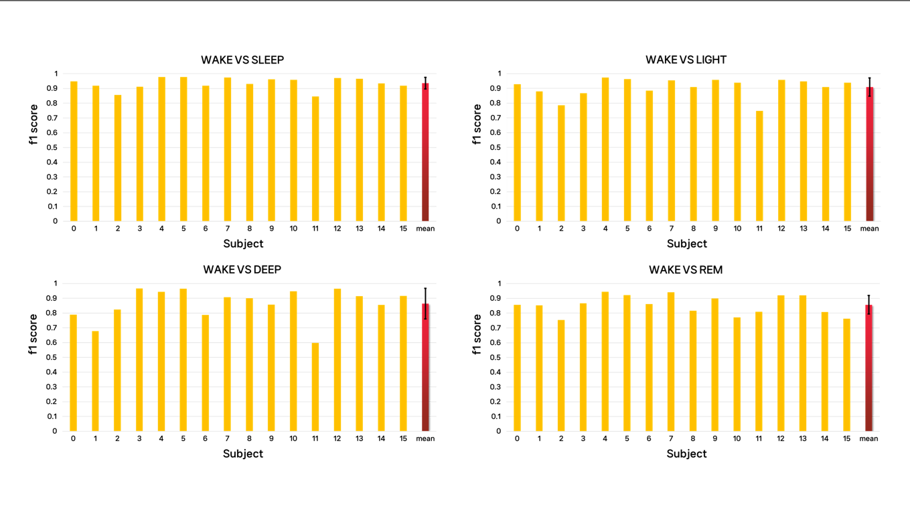

# Sleep Stage Classification with Accelerometer Data in Apple Watch

## Period
23.07.01 ~ 23.08.31

## Background
According to a study, the later sleep, wake up late, and walk less, people can't wake up at once after hearing the alarm in the morning.

But the biggest reason people can't hear an alarm is the time they set it

Occasionally during the sleep stages, a wake-up stage occurs, and in this stage, people can easily wake up if they hear an alarm.

To wake up, thry can set the alarm time using sites and apps that calculate the sleep cycle. However, these apps cannot calculate the sleep cycle that is unique to each person, making it difficult to accurately identify the awakening and shallow sleep. 

So, I thought that using acceleration data would be more helpful than the application, so that it would be easy to wear it in a watch format to accurately and conveniently identify the sleep stage.

In other words, I set my project goal to calculate personalized sleep stages.

## Data
https://physionet.org/content/sleep-accel/1.0.0/

## File
* EDA.ipynb : EDA file of each subject's data
* Preprocessing.ipynb : Preprocessing file
* sleep_df.pkl : Data from all subjects after preprocessing
* Modeling.ipynb : Sleep classification modeling and results file by subject

## Method

The preprocessing was proceeded in the order of subject selection, motion preprocessing, heart rate preprocessing, and feature engineering.

Subjects selected subjects who met all three of the preceding conditions and selected a total of 16 subjects.
 - Subjects with a sleep time of 7.5 hours or more
 - Subjects who appear in all five stages of sleep
 - Subjects with no abnormalities in labelling

In motion data, a 0.5 Hz high pass filter was applied to remove the gravity component.  

In heart rate, data interpolation was used every second. After that, DOG filter was applied. Finally, normalization was performed by dividing the data by the 90th percentile of the absolute value of the difference between the average heart rate.

Finally, after extracting features that were effective in classifying sleep stages in previous studies, we selected features that were meaningful to individuals based on feature importance while increasing the number.

## Result
As a result of the 2-class classification, it showed a high f1 score overall, indicating that it was successfully modeled.

  
## Expected Outcomes
It can contribute to developing more convenient and accurate diagnostic tools than conventional sleep measurement methods, and can analyze sleep stages and identify sleep-related diseases with a more user-friendly approach.

In addition, if the watch accurately detects the sleep stage in real time and sets off the alarm at the desired sleep time or wake-up time, the user will be able to wake up refreshed.

## References
* Olivia Walch, Yitong Huang, Daniel Forger and Cathy Goldstein *Sleep stage prediction with raw acceleration and photoplethysmography heart rate data derived from a consumer wearable device (SLEEPJ , 2019)*
* Andy Stamm, Ronny Hartanto, *Feature Extraction from MEMS Accelerometer and Motion Tracking Measurements in Comparison with Smart Bands during Running (MDPI, 2018)*
* Andy Stamm, David V. Thiel, *Investigating forward velocity and symmetry in freestyle swimming using inertial sensors (Procedia Engineering, 2015)*
